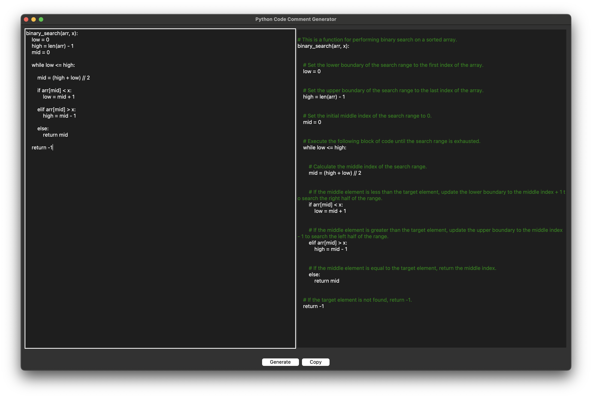

# Python Code Comment Generator

Python Code Comment Generator is a desktop application built with Tkinter that allows users to generate comments for their Python code using OpenAI's powerful language model. Users can paste their Python code into the input text area, and the app will provide comments for each line, explaining what the code does.



## Features

- **User-Friendly Interface**: The app features a simple and intuitive interface with two text areas, one for inputting Python code and another for displaying the code with comments.

- **OpenAI Integration**: Utilizes the OpenAI API to generate informative comments for each line of Python code.

- **Quick Copy**: Easily copy the code with comments to the clipboard for convenient sharing or use.

## How to Use

1. **Paste Your Code**: Copy and paste your Python code into the first text area.

2. **Generate Comments**: Click the "Generate" button to initiate the OpenAI request for generating comments. The app will provide comments for each line.

3. **View Comments**: The generated comments will be displayed in the second text area, providing explanations for each line of code.

4. **Copy to Clipboard**: Use the "Copy" button to copy the code with comments to the clipboard for easy sharing or use.

## Dependencies

- `tkinter`: Python's standard GUI library for creating the desktop application.
- `openai`: Python library for interfacing with the OpenAI API.

## Installation

1. Clone the repository:

   ```bash
   git clone https://github.com/Fifus17/Python-Code-Comment-Generator.git
   ```

2. Install the dependencies:

    ```bash
    pip install -r requirements.txt
    ```

3. Create an API key for the OpenAI API by following the instructions and paste it into the `OPENAI_API_KEY` variable in `key.py`.

    ```python
    OPENAI_API_KEY = "your-api-key"
    ```

4. Run the application:

    ```bash
    python Application.py
    ```